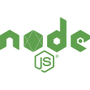

# Hi, I'm Josh! 

Glad to see you here! I'm **Josh**, a **Software Engineer** with a strong passion for building scalable applications with **TypeScript**, **Go**, **React** and **Node.js**. Recently won 🏆 Best in Category at JumpStart Hackathon for developing a DEI transparency platform. I'm currently working on Wooster, an AI-powered trip planning app.

Before I got into coding, I spent a decade at fintech startups in sales and product management, where I gained deep experience in understanding user needs and delivering impactful solutions. Now, I bring that same user-centric mindset to software engineering—focusing on creating tools that solve real problems.

## Tech stack

  
   
    &nbsp;&nbsp;
   
    &nbsp;&nbsp;
  
  &nbsp;&nbsp;
  
  &nbsp;&nbsp;
  
  &nbsp;&nbsp;
    
  &nbsp;&nbsp;
  
  &nbsp;&nbsp;
  
  &nbsp;&nbsp;
  
  &nbsp;&nbsp;
   
  &nbsp;&nbsp;
  
  &nbsp;&nbsp;
  
  &nbsp;&nbsp;
  
  &nbsp;&nbsp;
  
   &nbsp;&nbsp;
  

## Current Major Projects:

###  [Wooster](https://github.com/joshuaisaact/Wooster)

An AI-powered trip-planning app built with **React**, **TypeScript**, **PostgreSQL**, and **Express.js**.

Wooster helps users plan trips and holidays by gathering information about destinations and activities using the **Gemini API**.

#### Links:
- **[Frontend Repository](https://github.com/joshuaisaact/Wooster)**
- **[Backend Repository](https://github.com/joshuaisaact/Wooster-server/)**

### [JoshDesk](https://joshdesk.live)

A Slack app for hybrid work coordination built with **Bun**, **TypeScript**, and **Bolt.js**. Uses **SQLite** for data storage and implements Slack's event-driven API with WebSockets. Deployed on **DigitalOcean**. Features instant status syncing, weather integration, and smart reminders. Currently used by teams across multiple companies.

#### Links:
- **[Live site](https://joshdesk.live)**

##  [Foundations](https://github.com/joshuaisaact/dei-dashboard) - 🏆 Hackathon Winner 🏆

🏆 **Best in Category Winner** at JumpStart Hackathon (October 2024)

A diversity and inclusion transparency platform built with **Next.js**, **React**, and **TypeScript**. Foundations helps jobseekers assess companies' commitment to diversity by visualizing gender pay gap data and employee-provided insights. Ideated, designed, and shipped in 24 hours.

#### Links:
- **[Live Demo](https://foundations-app.vercel.app/)**
- **[Project Submission](https://hackathon.party/projects/foundations-7jk8l9)**
- **[GitHub Repository](https://github.com/joshuaisaact/dei-dashboard)**

### [Goss](https://github.com/joshuaisaact/Goss)

 

A voice-note-focused social media app, designed with **mobile-first principles** and built in **Next.js**, **React**, and **TypeScript**.

Goss lets users create and share voice notes. The backend is powered by **Supabase**.

## Other Projects:

### [Auto Refresh Nano](https://github.com/joshuaisaact/Auto-refresher)

A lightweight Chrome extension that continuously refreshes until a user-entered word or phrase either appears or disappears.

### [brat quiz](https://github.com/joshuaisaact/brat-quiz)
A quiz website built in React, test your knowledge on whether certain objects or people are or are not brat.

## Past projects:

### [Atomize](https://github.com/joshuaisaact/Atomize-refactor)

A fork of Atomize, a todo app built in React. Converted the codebase to TypeScript, and refactored the entire state management approach, implementing global context and useReducer, removing 13 useEffects, 21 state variables, and fixing a number of significant bugs that were causing unintended behaviour, particularly with asynchronous state.

Thanks for visiting!

### Connect with me

