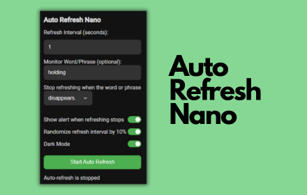

# Hi, I'm Josh! 

Glad to see you here! I'm **Josh**, a **Software Engineer** with a strong passion for building scalable applications, particularly with **TypeScript** and **Go**. I currently apply my skills as a Full Stack Software Engineer at **Let's Do This**, blending my passion for running with technology. Beyond my day role, I'm actively exploring the AI landscape, diving into building agents and experimenting with LLMs. My work also includes projects like Wooster, an AI-powered trip planner, and a 🏆 Best in Category win at JumpStart Hackathon for a DEI transparency platform.

Before I got into coding, I spent a decade at fintech startups in sales and product management, where I gained deep experience in understanding user needs and delivering impactful solutions. Now, I bring that same user-centric mindset to software engineering, focusing on creating tools that solve real problems.

## Current Major Projects:

### [AIgument](https://github.com/joshuaisaact/AIgument)

Forget boring benchmarks, watch AI models debate! Use **AIgument** to pit different LLMs (like GPT-4o, Claude 3 Sonnet, Gemini 2.5 Flash) against each other on any topic.

Assign unique personalities (e.g., Detective Noir, Drag Queen), control debate spiciness, and browse saved debates. Built with **Next.js**, **TypeScript**, **Tailwind CSS**, and the **Vercel AI SDK** integrating multiple leading LLM APIs and utilizing **Neon Serverless DB** for data persistence.

#### Links:
- **[Live Demo](https://aigument.vercel.app/)**
- **[GitHub Repository](https://github.com/joshuaisaact/AIgument)**

### [Wooster](https://github.com/joshuaisaact/Wooster)

An AI-powered trip-planning app built with **React**, **TypeScript**, **PostgreSQL**, and **Express.js**.

Wooster helps users plan trips and holidays by gathering information about destinations and activities using the **Gemini API**.

#### Links:
- **[Frontend Repository](https://github.com/joshuaisaact/Wooster)**
- **[Backend Repository](https://github.com/joshuaisaact/Wooster-server/)**

### [JoshDesk](https://joshdesk.live)

A Slack app for hybrid work coordination built with **Bun**, **TypeScript**, and **Bolt.js**. Uses **SQLite** for data storage and implements Slack's event-driven API with WebSockets. Deployed on **DigitalOcean**. Features instant status syncing, weather integration, and smart reminders. Currently used by teams across multiple companies.

#### Links:
- **[Live site](https://joshdesk.live)**

##  [Foundations](https://github.com/joshuaisaact/dei-dashboard) - 🏆 Hackathon Winner 🏆

🏆 **Best in Category Winner** at JumpStart Hackathon (October 2024)

A diversity and inclusion transparency platform built with **Next.js**, **React**, and **TypeScript**. Foundations helps jobseekers assess companies' commitment to diversity by visualizing gender pay gap data and employee-provided insights. Ideated, designed, and shipped in 24 hours.

#### Links:
- **[Live Demo](https://foundations-app.vercel.app/)**
- **[Project Submission](https://hackathon.party/projects/foundations-7jk8l9)**
- **[GitHub Repository](https://github.com/joshuaisaact/dei-dashboard)**

### [Goss](https://github.com/joshuaisaact/Goss)

 

A voice-note-focused social media app, designed with **mobile-first principles** and built in **Next.js**, **React**, and **TypeScript**.

Goss lets users create and share voice notes. The backend is powered by **Supabase**.

## Other Projects:

### [Bun Server Starter](https://github.com/joshuaisaact/bun-server-starter)

A production-ready Bun HTTP server template featuring TypeScript, logging with Pino, and comprehensive typed error handling. Designed to provide a solid foundation for building HTTP APIs.

### [Go AI Agent Foundation](https://github.com/joshuaisaact/Go-AI-Agent)

A foundational Go project for building AI agents that can interact with users and utilize tools. Uses the Anthropic (Claude) API by default and includes tools like file system operations (`read_file`, `list_files`, `edit_file`) and `ripgrep` integration for powerful text searches.

### [Auto Refresh Nano](https://github.com/joshuaisaact/Auto-refresher)

A lightweight Chrome extension that continuously refreshes until a user-entered word or phrase either appears or disappears.

Thanks for visiting!

### Connect with me

